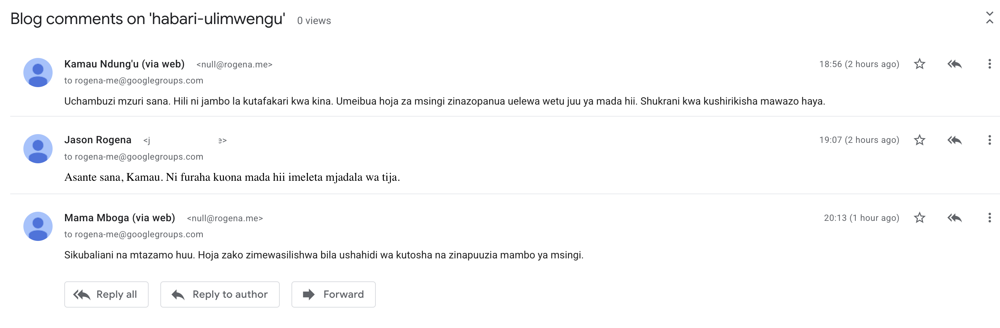

# threadmail

Static-site comments backed by a mailing list, not a database.

Every comment is a real RFC 5322 email, threaded via `In-Reply-To`/`References` like any mail client. No JavaScript, no database of comments: the mailing list is the only system of record. A single Rust binary resolves and renders a thread on demand, and optionally relays no-JS web-form submissions into the list as email.

## Screenshots

A thread rendered by threadmail:


The same thread as an actual mailing list conversation in Google Groups:



## Tenets

- **Privacy.** No real email address is ever rendered, in any form. The web form collects only a name and a comment body.
- **Standards-based, for posterity.** Comments live in the mailing list, not in threadmail. The local SQLite file is a disposable cache and a delivery-retry queue, never a record of what was said — see How it works.
- **Simplicity.** One binary, no JavaScript. Embedding a thread is one `<iframe>` tag. Moderation is fully delegated to the mailing list provider.

## How it works

A bot account subscribed to the list receives a copy of every message; threadmail reads that account's own IMAP mailbox (no Google Groups API, works with any mailing list technology). A post's slug is the email `Subject`; the thread root is the earliest top-level message with that subject, and replies attach via `In-Reply-To`/`References`, falling back to "subject still carries the slug" for messages a client failed to thread correctly.

`GET /thread/<slug>` serves from a local cache, refreshed from IMAP in the background on an interval, so a page loads instantly and a traffic spike doesn't hammer the mail provider. A submitted comment is queued locally and relayed by SMTP in the background, retried until delivered or a TTL passes, so posting doesn't block on SMTP and a restart mid-delivery doesn't lose it. Both live in one SQLite file that's safe to delete: IMAP delivery, not that file, is what actually counts as said.

Comments arrive two ways, each independently toggleable in config: a no-JS `<form>` (relayed by the bot account over SMTP) or a plain `mailto:` link for commenting directly by email. Outbound IMAP searches and SMTP submissions are capped by a configurable semaphore, so a traffic spike can't hammer the mail provider.

## Embedding on a static page

A bare `<iframe>` is enough.

```html
<iframe src="https://comments.example.com/thread/my-post-slug" title="Comments"
  height="600" loading="lazy" style="width: 100%; border: none;"></iframe>
```

## Configuration

Copy `config.example.toml` and fill it in, then:

```sh
threadmail --config-path ./config.toml serve
```

See [DEVELOPMENT.md](DEVELOPMENT.md) for building, testing, and code layout.
